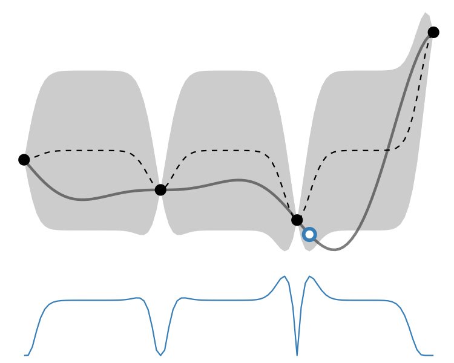
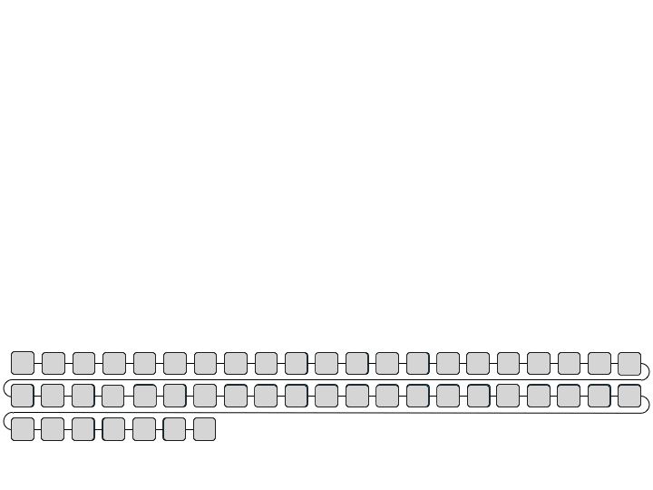

### *Hello!* I'm Tim Lin 👋

Welcome to my page! 

I'm an **AI Engineer**, currently living in Shanghai🏙. I have a strong passion for interdisciplinary of AI and Biology, particularly in:
- AI: Neural Networks, Generative Models, Reinforcement Learning, Bayesian Optimization
- Bio: Bioprocess Modeling, Antibody Sequence Discovery

    

#### <ins>Languages and Tools:</ins>

   

#### <ins>Contact me:</ins>
 

